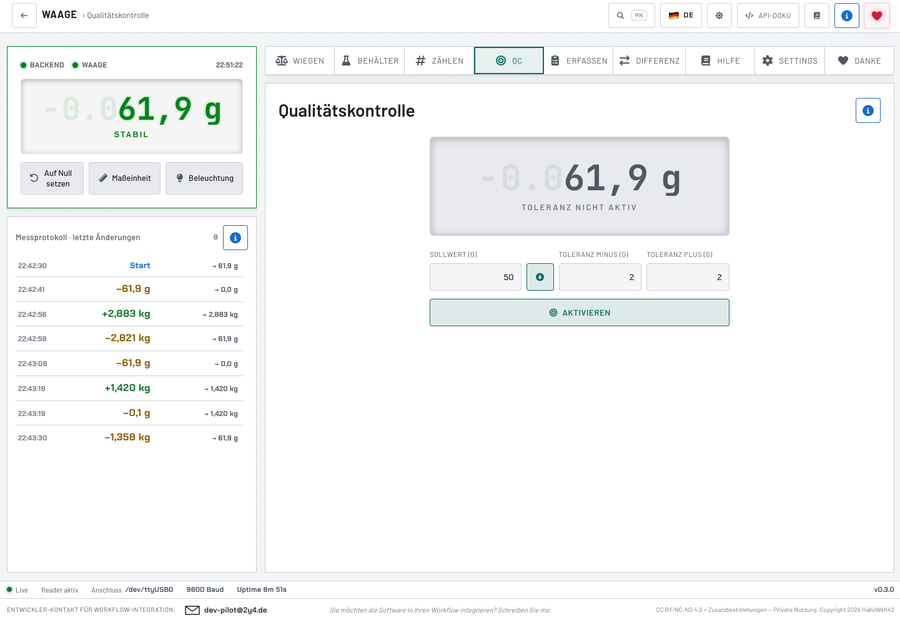
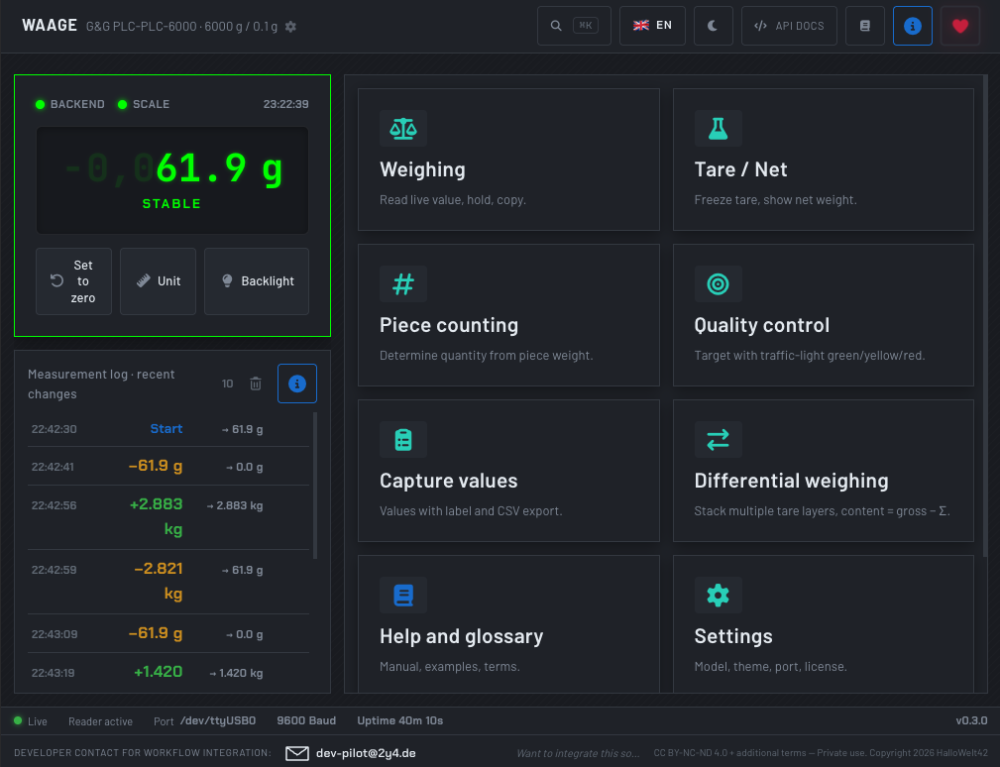
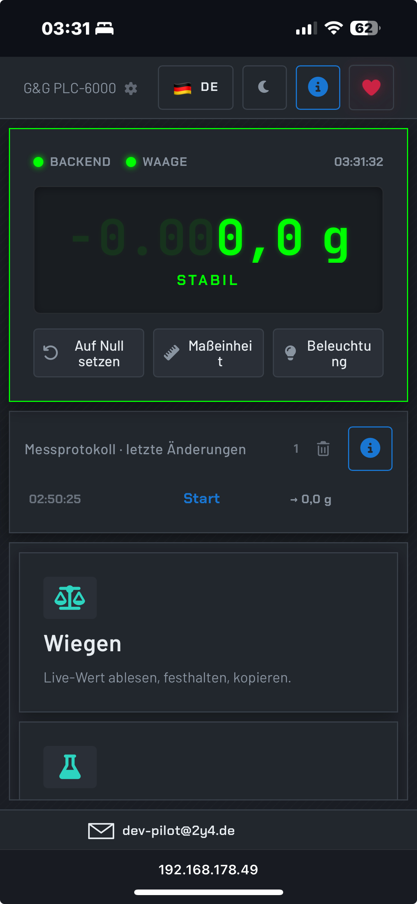

# Waage — RS232/USB-Schnittstelle für Präzisionswaagen

REST-, WebSocket- und Web-UI-Schnittstelle für **G&G** und kompatible
Präzisionswaagen, die per **RS232** über einen **USB-Serial-Adapter**
(FTDI / CP210x / PL2303 / CH340) an einen Raspberry Pi, Linux- oder
macOS-Host angeschlossen sind.

Das Backend (FastAPI) ist klar zweigeteilt:

- **Scale-Modul** unter `/scale/*` — reine Hardware-Funktion
  (Auslesen, Tara, Einheit, Beleuchtung, Modell-Verwaltung). Kann
  eigenständig in Drittsysteme eingebunden werden.
- **App-Modul** unter `/app/*` — UI-Komfort wie Toleranz-Ampel,
  Software-Tara, Stückzählung, Behälter-Bibliothek, Differenz-Wiegen,
  Mess-Snapshots und Messprotokoll.

Das Frontend (Svelte 5 SPA) ist ein kompletter UI-Stack mit
Industrial-Design, mehrsprachig (Deutsch / English), modell-bewusst
und nicht-eichfähig (siehe `DISCLAIMER.md`).

**Stack:** FastAPI · pyserial · Svelte 5 · Vite · nginx · SQLite ·
Docker Compose · Python 3.11+

## Eindrücke

<table>
  <tr>
    <td align="center" valign="top">
      <a href="media/desktop_dm.png">
        
      </a>
      <br /><sub><b>Desktop · Dunkel</b></sub>
    </td>
    <td align="center" valign="top">
      <a href="media/desktop_wm.png">
        
      </a>
      <br /><sub><b>Desktop · Hell</b></sub>
    </td>
    <td align="center" valign="top">
      <a href="media/mobile.png">
        
      </a>
      <br /><sub><b>Mobile · Hochformat</b></sub>
    </td>
  </tr>
</table>

## Architektur

```
+--------------+   RS232   +------+   USB    +-----------------------+
|  G&G PLC /   |  ------>  | FTDI |  ----->  |  waage-backend        |
|  JJ-B / EY / |           |      |          |  FastAPI :8200        |
|  TJ-Y / ...  |           +------+          |  /scale/* + /app/*    |
+--------------+                              +-----------+-----------+
                                                          | REST + WS
                                                          v
                                              +-----------------------+
                                              |  waage-frontend       |
                                              |  Svelte 5 + nginx :80 |
                                              +-----------+-----------+
                                                          |
                                                   Browser :8201
```

## Schnellstart

Plattform-unabhängiges Setup-Skript erledigt venv, npm install und
zeigt erkannte Hardware:

```bash
git clone git@github.com:HalloWelt42/RS232-to-USB-Waagen-REST-API.git
cd RS232-to-USB-Waagen-REST-API
./scripts/setup.sh
```

Funktioniert auf **macOS, Linux, Raspberry Pi OS** — Treiber-Hinweise
und Port-Erkennung kommen automatisch.

### Variante 1: Docker Compose (Linux / Raspberry Pi)

```bash
docker compose up -d --build
# Frontend  http://<host>:8201
# Backend   http://<host>:8200
# API-Docs  http://<host>:8200/docs
```

Datenpersistenz im `./data`-Volume:

```
data/
├── config.json            Aktives Modell, Polling, Source-Mode
├── samples.db             Erfasste Wäge-Snapshots
├── messlog.db             Diff-Liste der Werte-Änderungen
├── containers.db          Behälter-Bibliothek
└── count_templates.db     Stückzähl-Vorlagen
```

Alles bleibt zwischen Container-Neustarts erhalten.

### Variante 2: Native (macOS, Linux, Pi)

Auf macOS empfohlen, da Docker Desktop für Mac keine USB-Devices
durchreichen kann.

```bash
# Backend (im Wurzel-Verzeichnis)
cd backend
source .venv/bin/activate
python -m waage.api          # WAAGE_PORT=auto findet Adapter selbst

# Frontend (zweites Terminal)
cd frontend
npm run dev                  # http://localhost:5184
```

Optional persistent (sonst In-Memory):

```bash
WAAGE_DATA_DIR=$(pwd)/data \
  WAAGE_SAMPLES_DB=$(pwd)/data/samples.db \
  WAAGE_MESSLOG_DB=$(pwd)/data/messlog.db \
  WAAGE_CONTAINERS_DB=$(pwd)/data/containers.db \
  WAAGE_COUNT_TEMPLATES_DB=$(pwd)/data/count_templates.db \
  python -m waage.api
```

## API-Endpoints

Vollständig dokumentiert unter `/docs` (Swagger) und `/openapi.json`.

### Scale-Modul `/scale/*` (reine Hardware)

| Methode | Pfad | Zweck |
|---------|------|-------|
| GET     | `/scale/weight`              | Letzter Wert |
| GET     | `/scale/weight/stable?timeout=5` | Wartet auf Stable-Wert |
| GET     | `/scale/history?limit=100`   | Ringpuffer |
| WS      | `/scale/stream`              | Live-Push aller Frames |
| POST    | `/scale/command/tare`        | Auf Null setzen (ESC t) |
| POST    | `/scale/command/unit`        | Einheit umschalten (ESC s) |
| POST    | `/scale/command/light`       | Beleuchtung (ESC u) |
| GET     | `/scale/health`              | Reader-Status, Uptime, Source-Mode |
| GET     | `/scale/models`              | Liste bekannter Waagen-Modelle |
| GET     | `/scale/config`              | Aktives Modell + Toleranzen |
| PUT     | `/scale/config`              | Modell wechseln |
| GET/PUT | `/scale/source`              | Live ↔ Simulator umschalten |

### App-Modul `/app/*` (UI-Komfort)

| Methode | Pfad | Zweck |
|---------|------|-------|
| GET/POST/DELETE | `/app/tolerance`              | Soll/Min/Max + Ampel |
| GET/POST/DELETE | `/app/netto[/tare]`           | Software-Tara |
| GET/POST        | `/app/count[/calibrate,reset]` | Stückzählung |
| GET/POST/DELETE | `/app/count/templates[/{id}]` | Verwaltbare Stückzähl-Vorlagen |
| GET/POST/DELETE | `/app/samples[/{id},/stats,/export.csv]` | Mess-Snapshots mit Sessions |
| GET/POST/DELETE | `/app/differenz[/push,/{id}]` | Mehrfach-Tara-Stack |
| GET/POST/PUT/DELETE | `/app/containers[/{id}]`  | Behälter-Bibliothek |
| GET/DELETE      | `/app/messlog`                | Diff-Liste der Werte-Änderungen |

## Konfiguration (Backend Environment)

| Variable | Default | Bedeutung |
|----------|---------|-----------|
| `WAAGE_PORT`               | `auto`        | Serieller Port (`auto` = Auto-Erkennung) |
| `WAAGE_BAUD`               | `9600`        | Baudrate |
| `WAAGE_HOST`               | `0.0.0.0`     | Bind-Adresse |
| `WAAGE_API_PORT`           | `8200`        | HTTP-Port |
| `WAAGE_HISTORY`            | `1000`        | In-Memory-Ringpuffer-Größe |
| `WAAGE_CORS`               | `*`           | Allowed-Origins |
| `WAAGE_SIMULATE`           | —             | `1`/`true`: Simulator statt Hardware |
| `WAAGE_SAMPLES_DB`         | `:memory:`    | SQLite-Pfad für Mess-Snapshots |
| `WAAGE_MESSLOG_DB`         | `:memory:`    | SQLite-Pfad für Messprotokoll |
| `WAAGE_CONTAINERS_DB`      | `:memory:`    | SQLite-Pfad für Behälter-Bibliothek |
| `WAAGE_COUNT_TEMPLATES_DB` | `:memory:`    | SQLite-Pfad für Stückzähl-Vorlagen |
| `WAAGE_DATA_DIR`           | —             | Verzeichnis für `config.json` |
| `WAAGE_LOGLEVEL`           | `info`        | uvicorn-Loglevel |

## Unterstützte Waagen-Modelle

Die App kennt aktuell ~20 Modelle aus den Familien **PLC, JJ-B,
JJ-BC, JJ-BF, EY, TJ, TJ-Y, DJ, TC, PSE** des Herstellers G&G plus
einen `custom`-Eintrag. Ausgewählt wird im Settings-Tab; das aktive
Modell beeinflusst Anzeige-Auflösung, Maximalkapazität und
modell-spezifische Genauigkeits-Toleranzen.

Toleranzen pro Modell sind im `ScaleModel` hinterlegt
(`min_load_g`, `linearity_g`, `repeatability_g`, `stabilization_s`,
`warmup_min`, `operating_temp_c`). Das WiegenPanel warnt orange,
wenn die aktuelle Auflage unter der Mindest-Auflage liegt.

## Lokale Entwicklung

### Backend

```bash
cd backend
python3 -m venv .venv
source .venv/bin/activate
pip install -e ".[dev]"
pytest                    # 157 Tests grün
python -m waage.api       # läuft auf :8200
```

### Frontend

```bash
cd frontend
npm install
npm run dev               # läuft auf :5184, Proxy auf Backend
npm run test              # vitest — 56 Tests grün
npm run check             # svelte-check (TypeScript)
npm run build             # statisches Bundle in dist/
```

Im Dev-Modus proxyt Vite `/api/*` (REST + WebSocket) auf
`http://localhost:8200`, sodass Frontend und Backend in beiden
Modi (Dev und nginx-Production) ohne Code-Änderung laufen.

## Hardware

- **Adapter:** FTDI FT232RL USB-Serial (USB-VID:PID `0403:6001`)
  oder CP210x / PL2303 / CH340 — alle vier werden auto-erkannt.
- **Kabel:** Nullmodem-Adapter / Crossover zwischen Adapter und Waage
  (RX/TX gekreuzt, GND straight).
- **Host:** Raspberry Pi 5 / 4 / Zero 2 W, beliebiges Linux, oder macOS.

> Vollständige Hardware- und Protokoll-Referenz inkl. Anschlussplan,
> Stückliste und Foren-Erkenntnissen: **[`docs/HARDWARE.md`](docs/HARDWARE.md)**
> Vollständige Funktions-Referenz aller App-Tools und Endpunkte:
> **[`docs/FUNCTIONS.md`](docs/FUNCTIONS.md)**

### Linux / Raspberry Pi

```bash
lsusb | grep -i ftdi              # Adapter sichtbar?
ls -l /dev/ttyUSB0                # Device-Knoten muss da sein
sudo usermod -aG dialout $USER    # Einmalig: Zugriffsrechte
newgrp dialout
```

### macOS

FTDI-VCP ist seit macOS 10.15 im System enthalten. Falls nicht:
`brew install --cask ftdi-vcp-driver` oder direkt von `ftdichip.com`.

Der Port erscheint als `/dev/cu.usbserial-FTxxxxxx`. Auto-Erkennung
findet ihn ohne manuelles Setzen.

**Achtung:** Docker Desktop für Mac reicht USB-Geräte nicht durch —
auf macOS bitte das Backend nativ starten.

## Simulationsmodus

Für Frontend-Entwicklung oder Demos ohne angeschlossene Waage:

```bash
# Native
WAAGE_SIMULATE=1 python -m waage.api

# Docker
WAAGE_SIMULATE=1 docker compose up -d --build
```

Der Simulator generiert realistische Frames mit Gewichts-Änderungen,
Stable/Unstable-Übergängen und Mess-Jitter — und ist von außen nicht
vom echten Reader zu unterscheiden, **außer dass die Waage-Status-LED
in der UI orange „SIMULATION" zeigt** (statt grünes „WAAGE"). Live ↔
Simulator-Wechsel ist zur Laufzeit über die Settings-Karte oder
`PUT /scale/source` möglich, kein Backend-Neustart nötig.

## Repo-Struktur

```
RS232-to-USB-Waagen-REST-API/
├── docker-compose.yml          Top-Level Service-Komposition
├── README.md
├── CHANGELOG.md
├── DISCLAIMER.md               Haftungsausschluss (DE+EN)
├── LICENSE                     CC BY-NC-ND 4.0 + Zusatzbestimmungen
├── VERSION                     Single Source of Truth
├── data/                       Volume für SQLite-DBs + config.json
├── mockups/                    HTML-Designstand v0.3
├── scripts/
│   ├── setup.sh                Plattform-Setup
│   └── bump.sh                 Versionierung + Tag
├── backend/                    FastAPI + pyserial
│   ├── pyproject.toml
│   ├── Dockerfile
│   ├── src/waage/              parser, reader, models, scale_api,
│   │                           app_api, samples, messlog, containers,
│   │                           count_templates, differenz, simulator
│   └── tests/                  pytest (157 Tests)
└── frontend/                   Svelte 5 + Vite + nginx
    ├── package.json
    ├── Dockerfile              Multi-Stage: Build, dann nginx
    ├── nginx.conf              /api/* + WebSocket-Upgrade, SPA-Fallback
    ├── vite.config.js          Dev-Proxy auf Backend
    ├── src/
    │   ├── App.svelte          Root, Routing, Stores
    │   ├── components/         UI-Bausteine + 9 Tool-Panels
    │   ├── lib/                api, stores, format, i18n, search
    │   ├── locales/de.ts       Master-Sprache
    │   └── locales/en.ts       Englisch
    └── tests/                  vitest (56 Tests)
```

## Versionierung

Single Source of Truth: `VERSION` im Repo-Wurzel. Bump-Skript:

```bash
./scripts/bump.sh patch    # 0.4.4 → 0.4.5
./scripts/bump.sh minor    # 0.4.4 → 0.5.0
./scripts/bump.sh 1.0.0    # explizit
```

Aktualisiert `VERSION` und `package.json`, fügt einen
`CHANGELOG.md`-Eintrag-Stub ein, committet und legt einen
annotierten Git-Tag an. `pyproject.toml` liest die Version
dynamisch aus `VERSION`.

## Lizenz und Haftung

- **Lizenz:** CC BY-NC-ND 4.0 + Zusatzbestimmungen — quelloffen, aber
  ausschließlich **private, nicht-kommerzielle Nutzung**. Volltext in
  [`LICENSE`](LICENSE), SPDX-Identifier `LicenseRef-Waage-NC-1.0`.

- **Haftungsausschluss:** Die Software ist **kein eichfähiges
  Mess-System** und nicht für Verkauf nach Gewicht, amtliche
  Mengenangaben oder medizinische Dosierungen mit gesetzlichen
  Toleranzen zulässig. Volltext in [`DISCLAIMER.md`](DISCLAIMER.md).

## Mitwirken

Pull Requests sind willkommen — siehe Contributor License Agreement
in [`LICENSE`](LICENSE), Abschnitt 4.
